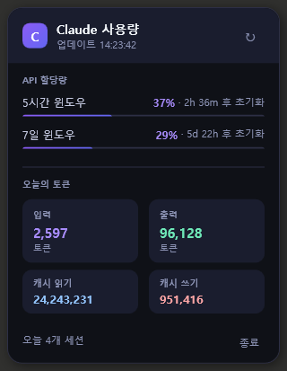

# Claude Usage Tray (Windows)

Windows 시스템 트레이에서 Claude AI 사용량을 실시간으로 모니터링하는 앱입니다.

> **[claude-usage-mini](https://github.com/jeremy-prt/claude-usage-mini) by [@jeremy-prt](https://github.com/jeremy-prt) 에서 영감을 받았습니다**

## 스크린샷



## 다운로드 (바로 실행)

> **[최신 릴리즈 다운로드 →](https://github.com/jeiel85/claude-usage-tray-windows/releases/latest)**

1. `ClaudeUsageTray.exe` 다운로드
2. 실행 — .NET 설치 불필요, 별도 설치 과정 없음
3. 시스템 트레이 아이콘 클릭으로 사용량 확인

## 요구 사항

- Windows 10 이상
- [Claude Code](https://claude.ai/code) 설치 및 로그인 상태
- .NET 런타임 **불필요** — 단일 실행 파일에 모두 포함됨

## 주요 기능

- **실시간 API 할당량** — 5시간 / 7일 윈도우 진행 바 및 초기화 시간
- **다음 갱신 카운트다운** — 헤더에 다음 자동 갱신까지 남은 시간 실시간 표시
- **스마트 에러 처리** — 조회 실패 시 마지막 성공 데이터 유지, 트레이 아이콘 `?` 표시
- **오늘의 토큰 통계** — 입력 / 출력 / 캐시 읽기 / 캐시 쓰기
- **Windows 토스트 알림** — 사용량 임계값(50% / 75% / 90% / 100%) 도달 시 알림
- **스마트폰 푸시 알림** — [ntfy.sh](https://ntfy.sh) 연동으로 iOS · Android 수신
- **자동 업데이트** — GitHub 새 릴리즈 감지 시 원클릭 업데이트
- **다국어 지원** — 한국어 · 중국어 · 일본어 · 영어 (시스템 언어 자동 감지)
- **2분마다 자동 갱신** (API 과호출 방지)
- **다크 테마 팝업 UI**
- **별도 로그인 불필요** — Claude Code 토큰 자동 재사용

## 시작하기

### 바로 실행 (권장)

[Releases 페이지](https://github.com/jeiel85/claude-usage-tray-windows/releases)에서 최신 `ClaudeUsageTray.exe` 다운로드 후 실행하세요.

> Windows Defender 경고가 뜰 수 있어요 → **추가 정보 → 실행** 클릭

### 소스에서 빌드

```bash
git clone https://github.com/jeiel85/claude-usage-tray-windows
cd claude-usage-tray-windows/ClaudeUsageTray
dotnet run
```

### 릴리즈 빌드

```bash
dotnet publish -c Release -r win-x64 --self-contained true -p:PublishSingleFile=true
```

## 알림 설정

팝업 하단 **⚙** 버튼으로 설정 창을 열 수 있어요.

### Windows 토스트 알림

5시간 윈도우 기준으로 임계값(기본: 50% / 75% / 90% / 100%) 도달 시 Windows 알림 센터에 알림이 표시됩니다.

### 스마트폰 푸시 알림 (ntfy.sh)

[ntfy.sh](https://ntfy.sh)는 무료 오픈소스 푸시 알림 서비스입니다.

1. iOS / Android에서 **ntfy 앱** 설치 → [ntfy.sh](https://ntfy.sh)
2. 앱에서 `+` 버튼 → 토픽 이름으로 구독 (예: `claude-usage-홍길동`)
3. 앱 설정 창의 **ntfy 토픽** 입력란에 동일한 이름 입력

이제 사용량 임계값 도달 시 Windows 알림과 동시에 스마트폰으로도 알림이 전송됩니다.

## 자동 업데이트

앱 시작 시 GitHub Releases를 확인하여 새 버전이 있으면 팝업 상단에 배너가 표시됩니다. 배너를 클릭하면 백그라운드에서 다운로드 후 자동으로 교체·재시작됩니다.

## 작동 원리

### 인증

Claude Code가 저장한 OAuth 토큰을 재사용합니다:
```
%USERPROFILE%\.claude\.credentials.json
```

### API 사용량

`https://api.anthropic.com/api/oauth/usage` 를 호출하여 5시간 / 7일 할당량을 가져옵니다.

### 로컬 세션 데이터

`%USERPROFILE%\.claude\projects\**\*.jsonl` 파일을 스캔하여 오늘의 토큰 사용량을 집계합니다.

## 기술 스택

| 구성 요소 | 기술 |
|-----------|------|
| UI 프레임워크 | WPF (.NET 9) |
| 시스템 트레이 | System.Windows.Forms.NotifyIcon |
| Toast 알림 | Microsoft.Toolkit.Uwp.Notifications |
| MVVM | CommunityToolkit.Mvvm |
| HTTP | System.Net.Http |
| 푸시 알림 | ntfy.sh |

## 프로젝트 구조

```
ClaudeUsageTray/
├── Models/
│   ├── Credentials.cs          # OAuth 인증 정보 모델
│   ├── UsageData.cs            # API 응답 + 세션 통계 모델
│   └── NotificationSettings.cs # 알림 설정 모델
├── Services/
│   ├── CredentialService.cs    # ~/.claude/.credentials.json 읽기
│   ├── UsageApiService.cs      # Anthropic 사용량 API 호출
│   ├── SessionMonitor.cs       # 로컬 .jsonl 세션 파일 파싱
│   ├── NotificationService.cs  # Windows toast + ntfy 알림
│   ├── SettingsService.cs      # 설정 저장/불러오기
│   ├── UpdateService.cs        # GitHub 자동 업데이트
│   └── LocalizationService.cs  # 다국어 문자열
├── ViewModels/
│   └── MainViewModel.cs        # 데이터 바인딩 + 비즈니스 로직
├── Views/
│   ├── UsagePopup.xaml         # 메인 사용량 팝업
│   └── SettingsWindow.xaml     # 알림 설정 모달
└── App.xaml.cs                 # 트레이 아이콘 + 앱 수명 주기
```

## macOS 원본과의 차이점

| 항목 | macOS (claude-usage-mini) | Windows (이 프로젝트) |
|------|--------------------------|----------------------|
| 언어 | Swift 6.2 + SwiftUI | C# + WPF (.NET 9) |
| 플랫폼 | macOS 26+ | Windows 10+ |
| UI 위치 | 메뉴바 | 시스템 트레이 |
| 인증 | 자체 OAuth PKCE 플로우 | Claude Code 토큰 재사용 |
| 알림 | macOS 알림 | Windows Toast + ntfy 푸시 |
| 자동 업데이트 | — | GitHub Releases 기반 |

## 기여하기

PR은 언제든 환영합니다!

## 라이선스

MIT License

---

*유용하게 사용하셨다면 원본 프로젝트 [claude-usage-mini](https://github.com/jeremy-prt/claude-usage-mini)에도 ⭐ 부탁드립니다.*
