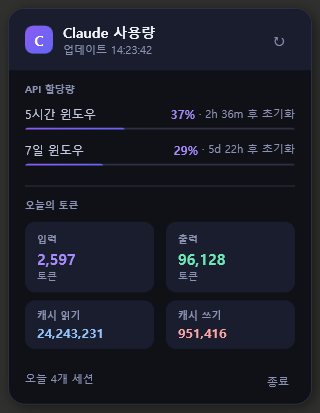

# Claude Usage Tray (Windows)


Windows 시스템 트레이에서 Claude, Codex(ChatGPT), Gemini CLI, OpenCode AI 사용량과 날씨 알림을 함께 확인하는 통합 모니터링 앱입니다.

> **[claude-usage-mini](https://github.com/jeremy-prt/claude-usage-mini) by [@jeremy-prt](https://github.com/jeremy-prt) 에서 영감을 받았습니다**

## 스크린샷



## 다운로드 (바로 실행)

> **[최신 릴리즈 다운로드 →](https://github.com/jeiel85/claude-usage-tray-windows/releases/latest)**

| 파일 | 크기 | 설명 |
|------|------|------|
| `ClaudeUsageTray.exe` | 약 32 MB | Framework-dependent 단일 실행 파일 — [.NET 9.0 Desktop Runtime](https://dotnet.microsoft.com/download/dotnet/9.0/runtime) 필요 |

**실행 방법:**
1. 위 링크에서 `ClaudeUsageTray.exe` 다운로드
2. 실행 (Windows Defender 경고 → **추가 정보 → 실행**)
3. 시스템 트레이 아이콘 클릭으로 사용량 확인

## 요구 사항

- Windows 10 이상
- [Claude Code](https://claude.ai/code) 설치 및 로그인 상태
- [**.NET 9.0 Desktop Runtime**](https://dotnet.microsoft.com/download/dotnet/9.0/runtime) — 미설치 시 앱이 실행되지 않음

## 공개 링크

- **GitHub Pages**: [jeiel85.github.io/claude-usage-tray-windows](https://jeiel85.github.io/claude-usage-tray-windows/)
- **최신 릴리즈**: [GitHub Releases latest](https://github.com/jeiel85/claude-usage-tray-windows/releases/latest)
- **변경 이력**: [CHANGELOG.md](CHANGELOG.md)

## 이슈
- `버그` 업데이트 배너 '클릭하여 설치' 문구 제거 (2026-06-19): 왼쪽 하단 버전 클릭/배너 클릭 동작은 유지하되, 배너에 다시 표시되던 과한 설치 유도 문구를 제거하고 4개 언어 업데이트 가능 문구를 간결하게 정리. #77
- `버그` 버전 클릭 업데이트 체크/모달 동작 회귀 복구 (2026-06-19): 왼쪽 하단 버전 텍스트 클릭 시 업데이트 체크 후 UpdateDialog 모달에서 다운로드를 진행하던 기존 동작을 복구하고, 배너 클릭과 수동 버전 클릭 경로를 분리. #76
- `버그` 안정성 회귀 복구 (2026-06-19): 트레이 아이콘 PropertyChanged 필터 완화로 인한 과다 갱신, Extra Usage 바인딩 불일치, WPF 통합 테스트 hang 문제를 복구하고 릴리즈 테스트 게이트를 추가. #75
- `버그` 트레이 아이콘 갱신 중 GDI+ 예외로 전역 오류창이 표시되는 문제 수정 (2026-06-18): `GetHicon()`으로 생성한 네이티브 아이콘 핸들을 즉시 해제하고, 아이콘 재그리기 실패 시 기존 아이콘을 유지해 앱 크래시를 방지. #74
- `버그` 업데이트 모달 팝업(UpdateDialog)이 표시되지 않고 배너만 노출되는 문제 수정 (2026-06-17): UpdateDialog.Show() → ShowDialog() 전환으로 모달 보장, Owner 지정으로 Z-order 문제 해결, 예외 처리 추가로 배너 fallback 확보. #73
- `개선` MainViewModel→ClaudeViewModel 완전 위임 및 Sync 브릿지 제거 (2026-06-17): MainViewModel에 남아있던 Claude 관련 [ObservableProperty] 11개를 제거하고 ClaudeViewModel으로 완전 이관. SyncClaudeVm() 브릿지(53줄) 삭제, XAML 바인딩을 ClaudeVm.*로 변경. 이로써 Claude 데이터의 단일 소유자가 ClaudeViewModel로 확정됨. #72
- `개선` ntfy 푸시 메시지에 PC 이름 추가 (2026-06-01): 모든 ntfy 푸시 알림 본문 하단에 발송 PC의 이름을 자동으로 표시하여 여러 PC에서 동일 토픽을 사용할 때 어느 PC에서 보낸 알림인지 식별 가능.
- `개선` MainViewModel God Object 리팩토링 (2026-05-29): 2000+ 라인의 MainViewModel을 각 공급자별 ViewModel(ClaudeViewModel, CodexViewModel, GeminiViewModel, OpenCodeViewModel, AntigravityViewModel, WeatherViewModel)로 분리하여 단일 책임 원칙(SRP) 준수 및 유지보수성 개선. 리팩토링 전 핵심 로직에 대한 단위 테스트 추가.
- `개선` Antigravity 모델 다수 노출 시 화면 잘림 방지 (2026-05-28): 사용률이 0% 초과인 활성 모델이 다수 존재할 때 메인 사용량 팝업 창이 너무 길어져 화면 경계 밖으로 잘리는 문제를 해결하기 위해 모델 목록을 MaxHeight="180" 제한이 적용된 ScrollViewer로 래핑하여 스크롤 제공.
- `개선` Antigravity 사용량 필터링 및 접기 기능 추가 (2026-05-28): Antigravity 모델 목록 중 사용률이 0% 초과인 모델만 노출하도록 필터링하여 불필요한 공백을 줄이고, 다른 공급자들과 마찬가지로 접었다 펼 수 있는 아코디언 접기 및 전체 % 노출을 지원하여 UI 일관성 개선.
- `변경` ntfy 알림 우선순위 분배 (2026-05-23): 모든 알림이 우선순위 4(고정)로 발송되던 것을 알림 종류와 임계값에 따라 1~5 단계로 분산. 100% 소진은 urgent(5)로 알림음 반복, 50%는 low(2)로 조용히 표시, Rate Limit/Quota Reset은 low(2), 조기 소진은 high(4). 날씨 특보는 기존 우선순위 유지.
- `개선` GitHub Pages/README/저장소 메타데이터 최신화 (#69, 2026-05-26): 최신 v1.30.6 기준으로 GitHub IO 랜딩 페이지, README 다운로드/기능 설명, GitHub 저장소 설명 및 토픽 태그를 점검하고 서로 다른 공개 정보(지원 공급자, .NET 런타임 필요 여부, 릴리즈 자산 크기)를 일관되게 정리.
- `버그` 테스트 빌드 실패 및 코드 안정성 개선 (2026-05-23): xUnit1031 규칙 위반으로 인한 테스트 프로젝트 빌드 실패 수정, 트레이 아이콘 GDI+ Bitmap 누수 해결, SHA256 업데이트 검증 실패 시 엄격하게 예외 발생, 날씨 알림 처리 중 예외를 무단 삼키던 빈 catch 블록 제거, 루트 폴더 미사용 오류 덤프 파일 정리.
- `개선` 작은 화면에서 팝업 자동 접기 (2026-05-21): work area 높이가 800px 이하인 작은 화면(노트북 등)에서 사용량 팝업을 열 때 모든 에이전트 섹션을 접은 상태로 시작. Claude 상세를 펼치면 팝업이 찌그러지는 문제 방지. 사용자가 원하는 공급자를 클릭하여 직접 펼칠 수 있음.
- `기능` 조기 소진 푸시 알림 (2026-05-21): 토큰 소진 속도가 예상보다 빨라 5시간 윈도우 하단에 조기 소진 라벨이 표시될 때, Windows 알림 및 ntfy 푸시 알림을 발송. 예상 소진 시각과 원래 초기화 시간을 비교하여 알려주며, 동일 윈도우 내에서는 중복 발송되지 않음.
- `개선` 초기화 시간 10분 미만 시 초 단위 카운트다운 표시 (2026-05-20): 리셋 시간이 10분 미만 남았을 때 "9m 59s"와 같이 초 단위로 정밀하게 표시하여 사용자가 정확한 초기화 시점을 파악할 수 있도록 개선.
- `개선` 에이전트 아코디언 모두 접기 허용 (2026-05-20): 메인 팝업에서 에이전트별 상세 사용량을 아코디언 방식으로 표시할 때, 기존에는 반드시 하나 이상 펼쳐져 있어야 했던 제약을 제거하여 모든 섹션을 접을 수 있도록 개선.
- `개선` 모바일 알림 표기 정리 (2026-05-18): 사용량 알림 제목을 "Claude 사용량 알림" → "에이전트 사용량 알림"으로 일반화하고, Codex/Gemini CLI 임계값 알림 본문에서 공급자 이름이 내부 키 그대로 소문자로 노출되던 문제(`codex` → `Codex` 등) 수정.
- `기능` 날씨 알림 및 트레이 날씨 정보 표시 (#63, 2026-05-14): 설정 창에서 날씨 알림 수신 여부와 위치를 설정하고, 현재 날씨/예보/특보를 기존 ntfy 경로로 발송하며 트레이 툴팁에 현재 위치와 날씨 정보를 표시하는 기능 설계.
- `개선` CI 실패 대응 (2026-04-29): `v1.21.0` 태그 기준 GitHub Actions 빌드 실패 원인(C# 소스 말미 중복 코드로 인한 컴파일 오류) 분석 및 수정.

---

## 주요 기능

**통합 모니터링 (Multi-Provider Support)**
- **Claude (API)**: 실시간 5시간 / 7일 윈도우 할당량 및 소진 예측
- **Codex (ChatGPT Plan)**: ChatGPT 플랜 사용량 상태 확인
- **Gemini CLI**: 로컬 로그 기반 요청 수 및 출력 토큰 실시간 추적
- **OpenCode**: 로컬 DB 기반 오늘의 입력/출력 토큰 모니터링
- **날씨 알림**: 설정한 위치의 현재 날씨, 예보, 특보를 트레이 툴팁과 알림 경로로 확인
- **통합 트레이 툴팁**: 아이콘에 마우스를 올리면 4개 공급자의 상태 요약 즉시 확인
- **동적 트레이 아이콘**: Claude 5시간 사용량 기준 게이지 표시

**상세 분석**
- **오늘의 토큰 통계 (Claude)**: 입력 / 출력 / 캐시 읽기 / 캐시 쓰기 토큰을 색상별로 구분 표시
- **비용 참고치**: 오늘 사용한 토큰량을 USD 달러 비용으로 환산 표시
- **7일/24시간 차트**: 일별 사용 추이 및 시간대별 사용 분포 시각화
- **자동 갱신**: 1~10분 주기로 배경에서 실시간 데이터 동기화 (기본 2분)
- **초 단위 카운트다운**: 리셋 시간 10분 미만 시 "9m 59s" 형식으로 초 단위 정밀 표시

**스마트 알림**
- **임계값 알림**: 설정된 임계값(50% / 75% / 90% / 100%) 도달 시 Windows 알림
- **조기 소진 알림**: 5시간 윈도우보다 빠르게 토큰이 소진될 것으로 예상되면 Windows 및 ntfy 알림 발송
- **모바일 푸시**: [ntfy.sh](https://ntfy.sh) 연동으로 스마트폰(iOS/Android) 실시간 푸시 수신

**편의 기능**
- **다국어 지원**: 한국어, 영어, 일본어, 중국어 완벽 지원 (설정 창에서 즉시 변경 가능)
- **무설치 단일 파일**: 별도의 설치 과정 없이 `exe` 파일 하나로 실행 (.NET 9.0 Desktop Runtime 필요)
- **자동 업데이트**: 새 버전 출시 시 팝업 알림 및 원클릭 업데이트

---

## 작동 원리

### 1. Claude (API)
- **인증**: Claude Code가 로컬에 저장한 인증 정보를 재사용합니다. 별도의 로그인이 필요 없습니다.
- **할당량**: Anthropic 공식 API를 호출하여 5시간/7일 잔여량을 가져옵니다.
- **로컬 통계**: Claude Code의 로컬 로그를 스캔하여 오늘 사용한 상세 토큰량과 비용을 집계합니다.

### 2. Gemini CLI
- **로그 분석**: Gemini CLI가 생성하는 로컬 임시 로그 폴더를 실시간 감시합니다.
- **실시간 파싱**: 로그 파일에서 요청 수 및 토큰 정보를 추출하여 합산합니다.

### 3. Codex (ChatGPT)
- **상태 추적**: Claude Code의 인증 컨텍스트를 통해 연동된 Codex(ChatGPT) 공급자의 사용량 상태를 동기화합니다.

### 4. OpenCode
- **DB 분석**: OpenCode가 로컬에 저장하는 SQLite DB에서 오늘 사용된 메시지의 입력/출력/캐시 토큰을 집계합니다.

### 5. Antigravity (Google Gemini Code Assist IDE) — v1.31.0+
- **인증**: Windows Credential Manager 의 `gemini:antigravity` 항목(Antigravity 가 로그인 후 자동 저장하는 OAuth refresh token)을 재사용.
- **할당량**: `daily-cloudcode-pa.googleapis.com/v1internal:retrieveUserQuota` 를 1시간 주기로 호출하여 모델별 잔여 비율 + 다음 리셋 시각을 받음.
- **표시**: Gemini 2.5/3.x 계열, Claude Sonnet/Opus 4.6 (Thinking), GPT-OSS 120B 등 사용자 plan 에 포함된 모델 전부 progress bar 로 렌더.
- **사전 설정 필요**: 비공식 API 라 OAuth client 자격 증명을 사용자가 직접 추출해 다음 경로에 두어야 합니다 — 파일이 없으면 섹션이 자동으로 숨겨집니다.

  ```
  %APPDATA%\ClaudeUsageTray\antigravity-oauth-client.json
  ```

  ```json
  {
    "client_id": "<Antigravity's OAuth client ID>",
    "client_secret": "<Antigravity's OAuth client secret>"
  }
  ```

  값 추출 방법은 [docs/antigravity-setup.md](docs/antigravity-setup.md) 참고. Antigravity 2.0 마이너 업데이트로 값이 바뀌면 파일을 다시 채워야 합니다.

---

## 시작하기

### 바로 실행 (권장)

[Releases 페이지](https://github.com/jeiel85/claude-usage-tray-windows/releases)에서 최신 `ClaudeUsageTray.exe` 다운로드 후 실행하세요.

### 소스에서 빌드

```bash
git clone https://github.com/jeiel85/claude-usage-tray-windows
cd claude-usage-tray-windows
dotnet run --project ClaudeUsageTray
```

## 알림 설정

팝업 하단 **⚙** 버튼으로 설정 창을 열 수 있어요.

### Windows 알림
임계값(기본: 50% / 75% / 90% / 100%) 도달 시 Windows 알림 센터에 알림이 표시됩니다.

### 스마트폰 푸시 알림 (ntfy.sh)
설정 → ntfy 탭에서 토픽 이름을 입력하면 PC 알림이 그대로 스마트폰에 푸시돼요. 자세한 설치/보안/멀티-PC 가이드는 ↓ **[ntfy 가이드](#ntfy-guide)** 를 참고하세요.

---

<a id="ntfy-guide"></a>

## 📱 ntfy 가이드 — 스마트폰 푸시 알림

[ntfy.sh](https://ntfy.sh) 는 무료 오픈소스 푸시 서비스예요. 토픽 이름 하나만 일치시키면 PC의 사용량 알림이 즉시 스마트폰으로 전달됩니다 (서버 가입/로그인 불필요).

### 1. ntfy 앱 설치

| 플랫폼 | 다운로드 |
|--------|---------|
| iOS    | [App Store](https://apps.apple.com/app/ntfy/id1625396347) |
| Android | [Google Play](https://play.google.com/store/apps/details?id=io.heckel.ntfy) · [F-Droid](https://f-droid.org/packages/io.heckel.ntfy/) |

무료, 광고 없음, 계정 가입 불필요.

### 2. 토픽 이름 정하기 (보안 핵심)

ntfy 의 토픽 이름은 **공개 URL의 일부**예요. 누구든 같은 이름을 알면 동일한 토픽을 구독하거나 메시지를 보낼 수 있어요.

**권장**
- **20자 이상**의 예측 불가능한 이름
- 영문 소문자 / 숫자 / `-` / `_` / `@` / `.` 만 사용
- 예: `claude-usage-yongeunpark-k7r3a9-2026`

**피해야 할 이름**
- 짧거나 흔한 이름 (`my-claude`, `notifications`, `usage-alerts` 등)
- 본인 이메일/실명을 그대로 노출
- 다른 곳에서 이미 쓰고 있는 식별자

설정 창에 짧거나 형식이 맞지 않는 이름을 넣으면 트레이 앱이 검증 경고를 표시합니다.

### 3. 앱에서 토픽 구독

1. ntfy 앱 실행 → 우하단 **+** 버튼
2. **Subscribe to topic** 선택
3. 위에서 정한 토픽 이름을 입력 → **Subscribe**

### 4. 트레이 앱에 같은 토픽 입력

1. 시스템 트레이 아이콘 클릭 → 팝업 하단 **⚙ 설정**
2. **ntfy** 탭 → **토픽 이름** 칸에 위와 똑같은 이름 입력 → Enter

저장되는 즉시 헤더에 ✓ 가 잠깐 표시돼요.

### 5. 테스트

설정 창의 **알림** 탭 → **테스트 알림** 버튼을 누르면 Windows 토스트와 함께 스마트폰에도 푸시가 도착해야 정상입니다. 오지 않으면:

- 스마트폰 ntfy 앱에서 해당 토픽이 **구독 목록**에 있는지 확인
- ntfy 앱 알림 권한이 OS 설정에서 허용되어 있는지 확인 (iOS 는 특히 첫 1회 거부 시 차단 유지)
- 설정 창의 **이 PC에서 ntfy 알림 발송** 토글이 켜져 있는지 확인

### 여러 PC 에서 같은 토픽을 쓰는 경우

같은 토픽을 PC 두 대 이상에서 쓰면 알림이 중복 발송돼요. **PC 한 대에만** "이 PC에서 ntfy 알림 발송"을 켜고, 나머지 PC에서는 끄세요. 구독 = 모든 기기에서 동일하게 받음 / 발송 = 한 PC에서만.

### FAQ

- **Q. 정말 무료인가요?** A. ntfy.sh 공개 인스턴스는 완전 무료예요. 더 강한 격리가 필요하면 자체 ntfy 서버를 띄울 수도 있지만 일반 사용에는 불필요합니다.
- **Q. 다른 사람이 가짜 알림을 보낼 수도 있나요?** A. 토픽 이름이 노출되면 가능합니다. 그래서 20자 이상 예측 불가능한 이름이 핵심이에요.
- **Q. 알림이 늦게 와요.** A. ntfy 는 보통 1~2초 안에 도달합니다. 지연이 잦다면 스마트폰 배터리 최적화에서 ntfy 앱을 예외로 등록하세요.

---

## 면책 조항
이 앱은 공식 Anthropic 제품이 아닌 개인 프로젝트입니다. 표시되는 모든 수치는 로컬 로그와 API 응답을 기반으로 한 **참고용**이며, 실제 과금 데이터와는 차이가 있을 수 있습니다. 정확한 사용량은 각 서비스의 공식 대시보드에서 확인하시기 바랍니다.
